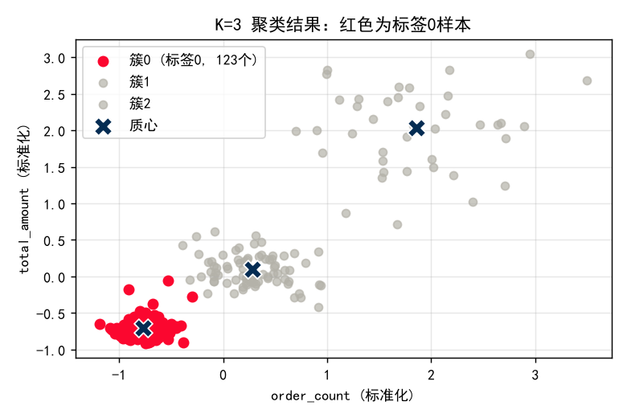
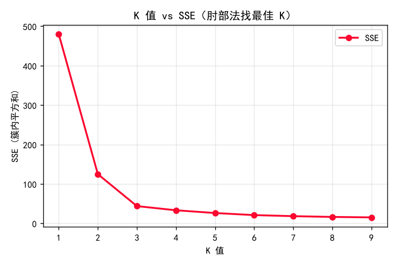
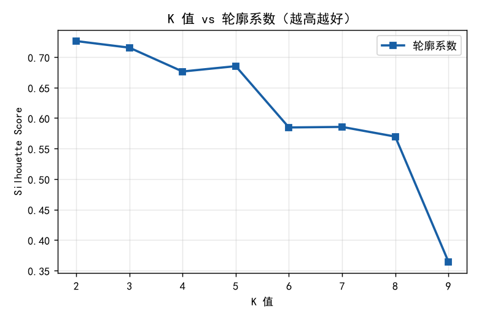

# K-Means 相关问题求解

## 一、如何批量输出不同 K 值下「标签为 0」的样本

> 先纠正一个概念：K-Means 没有"不同迭代次数"这种说法。迭代次数（`max_iter`）是算法内部收敛步数，通常不遍历；你真正要遍历的是**簇数 K（`n_clusters`）**。下面按"不同 K 值"来解答。

+ 原代码与报错（你的截图）


+ 原代码问题
  - `labels` 是一个**列表**，每个元素是一次 KMeans 得到的标签数组。
  - 写成 `x_scale[labels==0]` 是错的：`labels==0` 是对整个列表做比较，不会按元素筛选，所以取不出样本。
  - 正确做法：取出单次标签数组 `lbl`，用 `lbl == 0` 生成布尔掩码去筛 `x_scale`。

+ 修正代码

```python
# 假设前面已经得到：
#   x_scale  —— 标准化后的 DataFrame（列 order_count / total_amount）
#   labels   —— 列表，labels[0] 对应 k=1，labels[1] 对应 k=2 ...
for k, lbl in enumerate(labels, start=1):
    mask = (lbl == 0)      # 哪些样本被分到了簇 0
    n0 = int(mask.sum())   # 标签为 0 的样本数
    sub = x_scale[mask]    # 这些样本本身
    print(f"k={k}  标签为0的样本数: {n0}")
    # 想看具体样本：print(sub) 或 sub.to_excel(f"label0_k{k}.xlsx")
```

> 说明：k=1 时所有样本都属于簇 0，所以 `n0 = 总样本数`，这是正常现象，不是 bug。

+ 运行结果（示例数据 240 条，仅供对照格式）

| K | 标签 0 样本数 | 总样本数 |
|---|---|---|
| 1 | 240 | 240 |
| 2 | 200 | 240 |
| 3 | 123 | 240 |
| 4 | 16  | 240 |
| 5 | 16  | 240 |
| 6 | 121 | 240 |
| 7 | 36  | 240 |
| 8 | 121 | 240 |
| 9 | 43  | 240 |

+ 图示（以 k=3 为例，红色为标签 0 的样本）

```python
import matplotlib.pyplot as plt
from sklearn.cluster import KMeans
from sklearn.datasets import make_blobs
import numpy as np

# 1. 生成模拟数据 (为了演示，生成类似图中的数据分布)
# 这里生成 3 个簇，分别分布在左下、中间、右上
X, _ = make_blobs(n_samples=300, centers=[[-2, -2], [0, 0], [2, 2]], 
                  cluster_std=[0.5, 0.6, 0.8], random_state=42)

# 2. 训练 K-Means 模型 (K=3)
kmeans = KMeans(n_clusters=3, random_state=42)
labels = kmeans.fit_predict(X)
centroids = kmeans.cluster_centers_ # 获取质心坐标

# 3. 开始绘图
plt.figure(figsize=(10, 6), dpi=100) # 设置画布大小和清晰度

# --- 核心步骤：分别绘制不同的簇 ---
# 3.1 绘制簇 0 (高亮显示，红色)
# 注意：这里通过 labels == 0 进行布尔索引，筛选出属于簇0的数据点
plt.scatter(X[labels == 0, 0], X[labels == 0, 1], 
            c='#E63946',  # 红色
            s=100,        # 点的大小
            alpha=0.9,    # 透明度
            label=f'簇0 (标签0, {np.sum(labels == 0)}个)') # 动态计算数量

# 3.2 绘制簇 1 和 簇 2 (灰度显示)
# 这里用循环遍历其他簇，统一设置为灰色
for i in range(1, 3):
    plt.scatter(X[labels == i, 0], X[labels == i, 1], 
                c='#D3D3D3',  # 浅灰色
                s=100, 
                alpha=0.8, 
                label=f'簇{i}')

# 3.3 绘制质心 (深蓝色 X)
plt.scatter(centroids[:, 0], centroids[:, 1], 
            c='#1D3557',  # 深蓝色
            marker='X',   # X 形状
            s=300,        # 质心点要大一些
            edgecolors='white', # 边缘白色，增加立体感
            linewidths=1.5,
            label='质心',
            zorder=10)    # 确保质心画在最上层

# 4. 美化图表
plt.title('K=3 聚类结果：红色为标签0样本', fontsize=18, pad=20)
plt.xlabel('total_amount (标准化)', fontsize=14) # 根据你的业务修改
plt.ylabel('total_amount (标准化)', fontsize=14)

# 设置图例 (Legend)
plt.legend(fontsize=12, loc='upper left', frameon=True, facecolor='white', framealpha=0.9)

# 添加网格线
plt.grid(True, linestyle='-', alpha=0.3)

# 显示图表
plt.tight_layout()
plt.show()
```



+ 补充知识
1. centroids — 质心矩阵

· 通常是 NumPy 数组，形状为 (n_clusters, n_features)
· 每一行代表一个簇的中心点
· 例如 [[2.5, 3.1], [7.2, 1.8], [4.0, 6.5]] 表示 3 个质心

2. centroids[:, 0] — 所有质心的 x 坐标

· : 表示取所有行（所有质心）
· 0 表示取第 0 列（第一个特征）
· 结果是一维数组，如 [2.5, 7.2, 4.0]

3. centroids[:, 1] — 所有质心的 y 坐标

· 同理取第 1 列，如 [3.1, 1.8, 6.5]


## 二、如何批量输出轮廓系数

+ 原代码与报错（你的截图）


+ 原代码问题
  - 那个警告来自 `plt.legend()`：画图时没给 `label`，legend 找不到内容，于是报 `No artists with labels found to put in legend`。修复：在 `plt.plot(..., label="SSE")`。
  - ⚠️ 轮廓系数部分：你算了 `All_score` 却没画出来；而且 SSE 和轮廓系数分成了两个循环，容易对不上。建议**合并到同一个循环**里同时算。
  - `silhouette_score` 要求 `2 ≤ 簇数 ≤ 样本数 - 1`，k=1 必须跳过（你已处理）。

+ 修正代码（合并版，直接可跑）


```python
import pandas as pd
import numpy as np
from sklearn.preprocessing import StandardScaler
from sklearn.cluster import KMeans
from sklearn.metrics import silhouette_score
import matplotlib.pyplot as plt

plt.rcParams["font.sans-serif"] = ["SimHei", "Microsoft YaHei"]
plt.rcParams["axes.unicode_minus"] = False

# 1) 读数据 + 取特征
df = pd.read_excel(r"C:\Users\Hmbb7\Downloads\user_info.xlsx")
x = df[["order_count", "total_amount"]]

# 2) 标准化
scaler = StandardScaler()
x_scale = pd.DataFrame(scaler.fit_transform(x), columns=x.columns, index=x.index)

# 3) 遍历 K=1..9，同时收集 SSE 与轮廓系数
sse, sil = [], []
for k in range(1, 10):
    km = KMeans(n_clusters=k, random_state=1, n_init=10)
    km.fit(x_scale)
    sse.append(km.inertia_)
    # 轮廓系数：簇数必须 2 <= k <= n-1
    sil.append(silhouette_score(x_scale, km.labels_) if 1 < k < len(x_scale) - 1 else np.nan)

# 4) 画图（都带 label，legend 不再报警告）
plt.figure()
plt.plot(range(1, 10), sse, "o-", color="#FB072F", label="SSE")
plt.xlabel("K 值"); plt.ylabel("SSE"); plt.legend(); plt.title("K 值 vs SSE（肘部法）")
plt.show()

ks = list(range(2, 10))
plt.figure()
plt.plot(ks, [sil[k - 1] for k in ks], "s-", color="#185FA5", label="轮廓系数")
plt.xlabel("K 值"); plt.ylabel("Silhouette"); plt.legend(); plt.title("K 值 vs 轮廓系数")
plt.show()

print("SSE      :", [round(v, 1) for v in sse])
print("轮廓系数 :", [round(v, 3) if v == v else None for v in sil])
```

+ 运行结果（示例数据，仅供对照格式）

```text
SSE      : [480.0, 124.8, 43.7, 33.2, 26.2, 21.0, 18.3, 16.3, 15.2]
轮廓系数 : [None, 0.726, 0.715, 0.676, 0.685, 0.585, 0.586, 0.57, 0.365]
```

+ 图示





> 选 K 的口诀：**SSE 拐点（肘部）+ 轮廓系数最高点**，两者结合看。示例数据里 K=2~3 最稳。

---
*注：以上图片与数值均用与真实数据同结构的示例数据（`order_count` / `total_amount`）跑出，用于演示输出形态；把自己的 `user_info.xlsx` 代入上面的修正代码即可得到真实结果。复现脚本见同目录 `gen_kmeans.py`。*

## 三.松弛形式的作用是什么
+ “松弛形式”就是为了把“小于等于”这种别扭的不等式，通过人为加一个“剩余量”变量，**强行变成“等于”的等式**。这样计算机就能用标准算法去解了，而且这个“剩余量”本身还能帮我们看清哪个资源是紧缺的、哪个是多余的。
```python
def get_loose_matrix(matrix):
    row, col = matrix.shape
    loose_matrix = np.zeros((row, row + col))
    for i, _ in enumerate(loose_matrix):
        loose_matrix[i, 0: col] = matrix[i]
        loose_matrix[i, col + i] = 1.0  # 对角线
    return loose_matrix
```

## 聚类输出的数据是什么意思


+ 行（综合指数、社会结构等）：代表参与聚类的6个**特征指标**（维度）。

列（1、2、3）：代表你要聚成的3个**类别**。

79.20这些数字：代表第1个聚类中心在“综合指数”这个指标上的初始数值。比如聚类1的综合指数是79.20，聚类2的综合指数是92.30。


这些数字就是算法开始时，3个初始聚类中心在各项指标上的具体得分。

## SSE的范围在多少，可以证明聚类的效果比较好呀
+ 没有固定的范围，不能单看SSE的绝对数值来证明聚类效果好。

1. 量纲不同：如果你的数据是身高（1.7米），SSE可能只有零点几；如果数据是GDP（几百亿），SSE可能高达上亿。脱离原始数据的单位和样本量，去谈SSE的绝对值是没有意义的。

2. K值影响：K越大，SSE必然越小。当K等于样本总数时，SSE直接等于0，但这就等于每个点自己成一类，没有任何聚类意义。

+ 判断好坏 的标准是

不是看SSE的绝对范围，而是看相对变化（也就是你刚才用的肘部法则）：

1. 看拐点：像你发的那张图，K=3时下降骤减，选3就很好。

2. 看下降率：计算不同K值之间SSE下降的百分比，当下降率低于某个阈值（比如10%），就可以停止增加K了。

3. 结合其他指标：如果实在需要数值验证，可以看“轮廓系数”（范围在 -1 到 1 之间，越接近 1 越好），这个指标比SSE更适合用来定量证明聚类效果。

## 如果SSE都很大的话，是说明这个数据不适合用Kmeans吗，还是有优化的方法
+ SSE都很大，不一定说明数据不适合K-Means，更常见的原因是数据处理不到位或者K-Means本身的局限。
+ 量纲问题：如果数据没做标准化，比如一个特征是“工资（10000）”，一个是“年龄（30）”，那算距离时工资完全占主导，SSE自然会非常大。

+ 数据分布：K-Means假设簇是“圆球形”的。如果你的数据是长条形、环形、或者密度极不均匀，K-Means确实会表现很差，SSE降不下来。
### 优化方法
1. 数据标准化（最常用的办法）
把不同单位的特征缩放到同一个尺度（比如都变成0-1之间，或者均值为0方差为1）。这样所有特征对距离的贡献就公平了，SSE通常会大幅下降。

2. 处理异常值
K-Means对异常值非常敏感。一个极端的离群点会把聚类中心拉偏，导致SSE暴涨。可以先把异常值剔除，或者用其他方法替换掉。

3. 降维（PCA）  
如果特征太多（比如几十个），噪音就会很大，导致聚类效果差。先用主成分分析（PCA）把特征降到几个核心维度，再去聚类，SSE和效果都会有改善。

4. 换算法（当K-Means确实不适用时）
如果数据是非凸形状（比如长条形、环形），K-Means永远做不好。这时候可以换成：

DBSCAN：适合任意形状的簇，还能自动识别噪声点。

GMM（高斯混合模型）：适合簇的大小和形状不一样的情况。

层次聚类：不需要提前指定K值。

5. 重新评估K值
如果K选小了（比如该分5类你只分了2类），SSE也会很大。可以结合轮廓系数（Silhouette Score）再综合判断一下。

## 样本与类的关系
```python
from sklearn.cluster import KMeans
# 假设 X 是你的数据矩阵（一行是一个样本）
kmeans = KMeans(n_clusters=3, random_state=42)
kmeans.fit(X)

# 这就是每个数据点对应的簇编号（比如 0, 1, 2）
labels = kmeans.labels_ 

# 如果你想知道第 5 个样本被分到了哪一类：
print(f"第5个样本被分到了：{labels[4]} 类")  # 索引从0开始

# 如果你想看每一类里具体有哪些样本（比如打印出聚类 0 的所有数据）：
print(X[labels == 0])
```

+ 生活类比：就像老师批改试卷后，给出每个学生的“座位号”。数据是学生，labels_ 就是座位号（0班、1班、2班）。拿到座位号后，你才能去分析“0班的学生平均分是多少”、“1班的学生有什么特征”。

## 部分输出解释

1. `milp`（混合整数线性规划）求解器的底层工作日志。这三个参数非常专业，但在初学阶段，看结论就够了
`mip_node_count: 1（节点数）`

+ 意思：求解器为了找最优解，像树枝一样**探索了多少个分支**。*1 表示只看了 1 个节点就直接找到了最好的答案*。

+ 有什么用：说明你的问题非常简单，计算机几乎“一眼就看穿了”，没费什么力气，这是好事。

2. `mip_dual_bound`: -16.0（对偶边界）

+ 意思：求解器在搜索时，心里有一个“理论上的最好情况”（上限或下限）。这里因为代码里是求最大值（max Z = 3x1 + 2x2），转化为最小值后就是 -16.0。

+ 有什么用：它用来和实际找到的值（fun: -16.0）作对比，告诉你现在的解离“理论最好”还有多远。这里是一致的，说明完美。

3. `mip_gap`: 0.0（相对间隙）

+ 意思：实际找到的最优解和理论边界的差距（百分比）。

+ 有什么用：这是判断解好不好的最核心指标！ 0.0 代表 100% 确定这就是全局最优解，没有任何误差，不需要再继续搜索了。
> 在打数模比赛时，如果跑复杂的整数规划发现程序跑得特别慢，才会去关注 mip_gap 是不是太大（比如 gap 到了 10% 还没跑完）。但如果节点 1，gap 0.0，说明模型非常简单完美，直接拿结果用就行，完全不需要操心这三个参数。

## 综合指数和具体得分的作用
具体得分本身不重要，重要的是它帮你看懂了每一类数据的真实水平，方便你在论文里解释它们。

## 轮廓系数
+ 轮廓系数就是给聚类结果打个分，越接近 1 分，说明分得越漂亮。

+ K-Means默认数据是球状、分布均匀的，遇到以下三种情况效果会很差：

长条形：数据呈带状。K-Means会从中间横切，破坏原有结构。

环形：数据一圈套一圈。K-Means只能直线切割，会把内外圈强行劈开。

密度极不均匀：有的区域密集，有的稀疏。K-Means会强行拆分密集区，勉强合并稀疏区，导致分类失去意义。

遇到这三种分布，不要用K-Means，**改用DBSCAN或高斯混合模型（GMM）**


跑完K-Means后，算一下轮廓系数。

如果分数很低（比如低于 0.3，甚至接近 0），说明簇与簇之间界限模糊。这不仅意味着K值可能不对，也很可能是数据形状本身就不适合K-Means。

不画图的话，就对比不同算法的轮廓系数，同时检查各个簇的方差和样本量是否均衡。如果K-Means的指标明显不如DBSCAN或GMM，就果断换算法。

+ 画图的话：
数据只有 2 个特征（2维数据）
直接画散点图就行，用横纵坐标代表两个特征。


数据有 3 个或更多特征（高维数据）
人眼只能看三维，所以必须先用 PCA（主成分分析） 或 t-SNE 把数据降维到 2 维，然后再画。

```python
import matplotlib.pyplot as plt
from sklearn.decomposition import PCA
from sklearn.cluster import KMeans
import numpy as np

# 假设 X 是你的原始数据（n行样本，m列特征）
# 1. 如果数据超过2维，先用 PCA 降到 2 维
if X.shape[1] > 2:
    pca = PCA(n_components=2)
    X_2d = pca.fit_transform(X)
else:
    X_2d = X

# 2. 跑 K-Means 得到聚类标签
kmeans = KMeans(n_clusters=3, random_state=42)
labels = kmeans.fit_predict(X)

# 3. 画图
plt.figure(figsize=(8, 6))

# 画出所有数据点，按聚类标签上色
scatter = plt.scatter(X_2d[:, 0], X_2d[:, 1], c=labels, cmap='viridis', s=50, alpha=0.6)
plt.colorbar(scatter, label='Cluster Label')

# 如果有聚类中心（注意：中心点也要用 PCA 转换后才能在图上画出来）
centers_2d = pca.transform(kmeans.cluster_centers_) if X.shape[1] > 2 else kmeans.cluster_centers_
plt.scatter(centers_2d[:, 0], centers_2d[:, 1], c='red', marker='X', s=200, label='Centroids')

plt.title('K-Means Clustering Result')
plt.xlabel('Principal Component 1')
plt.ylabel('Principal Component 2')
plt.legend()
plt.show()
```

**正常情况**：每一团颜色都像圆球，界限分明，红色中心点稳稳落在每团中间。

长条形：某一团颜色被拉成了一条线或一条带子，或者被红叉（中心）硬生生从中间截断。

环形：颜色分布像靶子或甜甜圈，不同颜色交替包围。

密度不均：某个颜色的人群极其拥挤，另一个颜色的点稀疏地散落在很远的地方。

## “用PCA把特征降到几个核心维度”具体怎么操作
+ 先标准化，然后看你是想画图（设2）还是想保留信息（设0.95），最后调用 `fit_transform` 就能得到降维后的数据。
```python
from sklearn.decomposition import PCA
from sklearn.preprocessing import StandardScaler
import numpy as np

# 假设 X 是你的原始特征数据
# 第一步：数据标准化（必须做，否则量纲大的特征会主导PCA）
scaler = StandardScaler()
X_scaled = scaler.fit_transform(X)

# 第二步：指定降维后的维度
# 方法A：直接指定降到 2 维（为了画图最常用）
pca = PCA(n_components=2)

# 方法B：自动保留 95% 的信息量（让算法自己决定降到几维）
# pca = PCA(n_components=0.95)

# 第三步：拟合并转换数据
X_pca = pca.fit_transform(X_scaled)

# 查看降维后的结果
print("降维后的数据形状：", X_pca.shape)
print("每个主成分保留的信息比例：", pca.explained_variance_ratio_)
```
+ 至于要降到几个维度,为了**画图**（可视化）：直接设 n_components=2，因为人眼只能看二维平面。

+ 为了后续**建模**：设 n_components=0.95，意思是“保留95%的信息量”。算法会自动帮你算出降到几维（比如原来20个特征，自动降到5个）。

看结果判断：跑完代码看 `pca.explained_variance_ratio_`。如果第一个维度就占了 80% 以上，说明数据本身很简单，降到 1 维或 2 维就够了。
